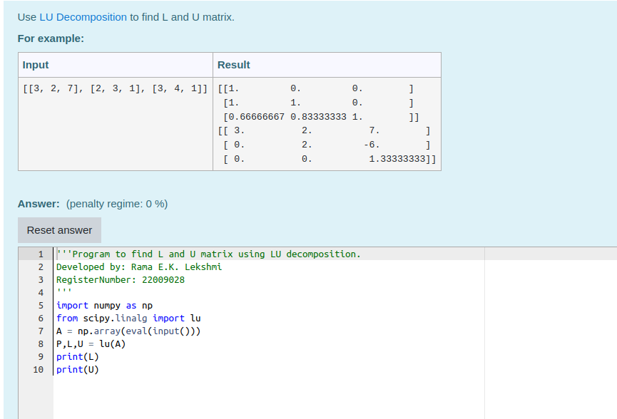
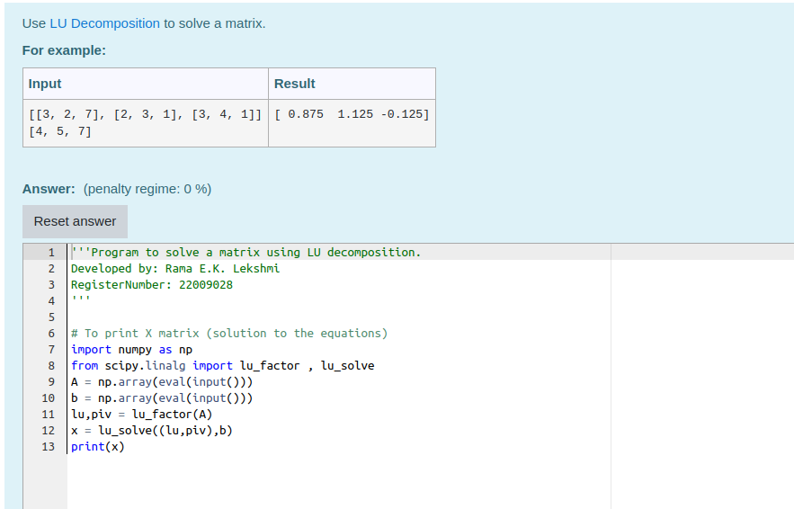

# LU Decomposition 

## AIM:
To write a program to find the LU Decomposition of a matrix.

## Equipments Required:
1. Hardware – PCs
2. Anaconda – Python 3.7 Installation / Moodle-Code Runner

## Algorithm
1. import maths as numpy
2. give the input values
3. use eval input
4. print the L and U matrix

## Program:
(i) To find the L and U matrix
```
/*
Program to find the L and U matrix.
Developed by: 
RegisterNumber: 
*/
```
(ii) To find the LU Decomposition of a matrix
```
/*
Program to find the LU Decomposition of a matrix.
Developed by: 
RegisterNumber: 
*/
```

## Output:




## Result:
Thus the program to find the LU Decomposition of a matrix is written and verified using python programming.

